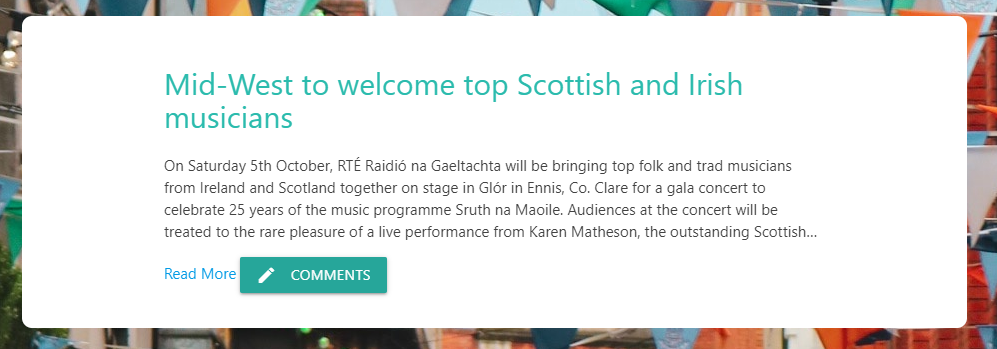
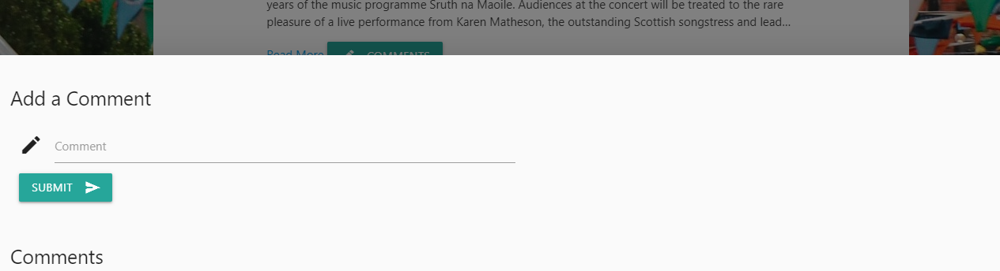

# mongo-scraper
a site scraper with Mongoose

heroku link: https://morning-wave-18975.herokuapp.com/

# Overview

This app scrapes stories from Irish Music Magazine and allows users to view the articles, save them, and comment on them (although currently the comments vanish into the ether...)

## Flow

The homepage displays the articles from the Irish Music Magazine (http://www.irishmusicmagazine.com/news/). Each article block includes the article title, about four lines of the article's text, and a link to the full article on Irish Music Magazine's website, all scraped from that site. Each block also includes a Save Article button. Clicking the Save Article button adds that article (and its accompanying information) to a Saved Articles collection.

All articles in the Saved Articles collection can be viewed by clicking the Saved Articles link in the nav bar. Each saved article block includes a Comments button. Clicking the Comments button generates a Modal. Within the modal, the user can submit a comment. Unfortunately, saved comments aren't currently displayed anywhere because I couldn't quite get the routes to work. *Sniff*. 

## Tech

Front End:
* Materialize
* Handlebars

Back End:
* MongoDB
* Mongoose
* Node.js
* Express

## Improvements

A lot to improve here, obviously - the comments need to be linked to their home articles and then need to be actually displayed somewhere. I also don't have a way to delete anything currently. I think the main area I need to improve on is getting all the routes to work. 

Annnnnd didn't quite get the 'scrape' and 'clear articles' buttons working either...ah well. 

## Minor Pride Points

I used Materialize on this for the first time on this assignment to get some experience with it, and I think the front end look actually came out pretty well. I also managed to make a decent looking modal, unlike the one I had on the friend finder assignment, ha!